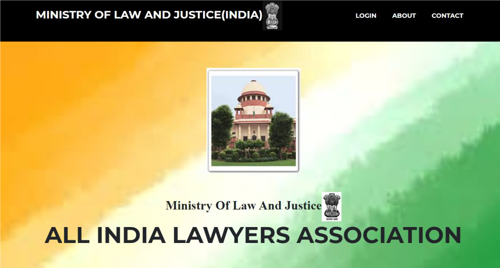
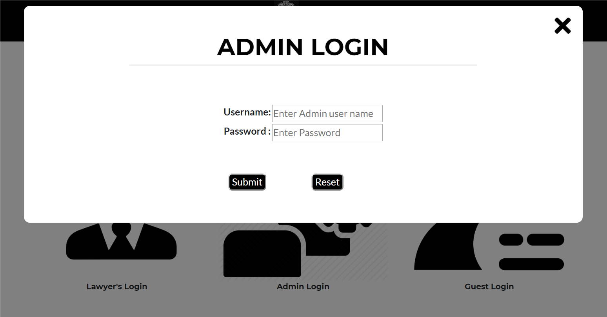
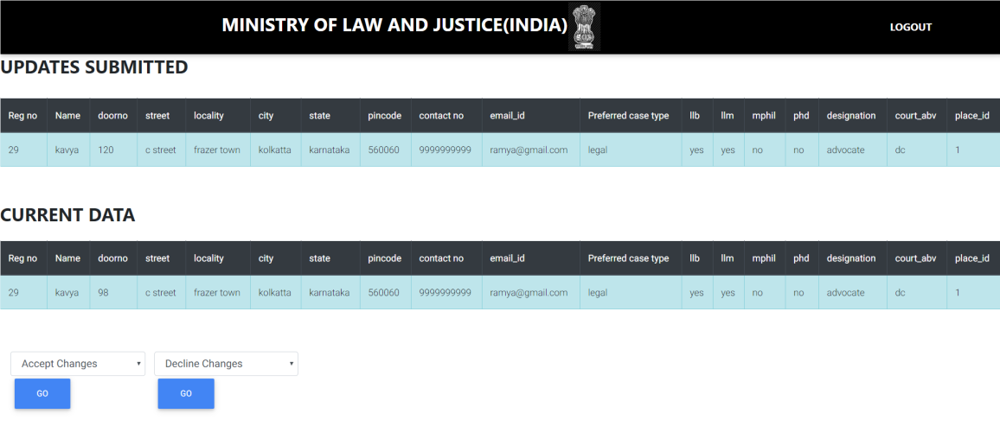

# Lawyer-s-management-System
An online portal for managing lawyers, court cases, customers in an organization.

A webservice for managing the lawyers, court cases and customers in an organization.

There are 3 types of users in the software 
1. Admin: Responsible for managing all the actions and managing all the update requests.
2. Lawyer: Responsible for handling all the cases in the organization.
3. User: User is the client to the organoization

